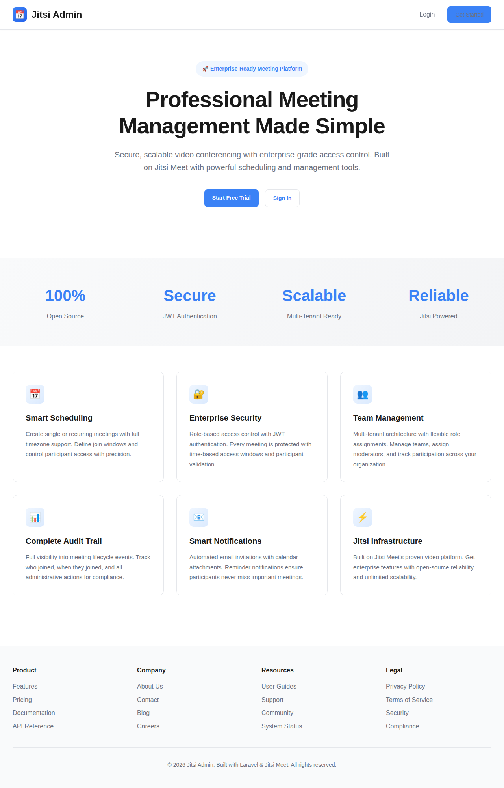
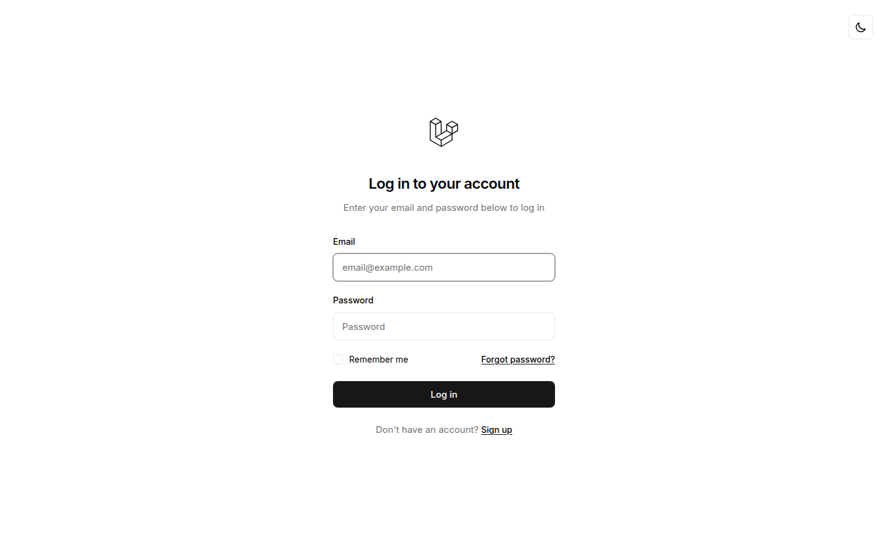
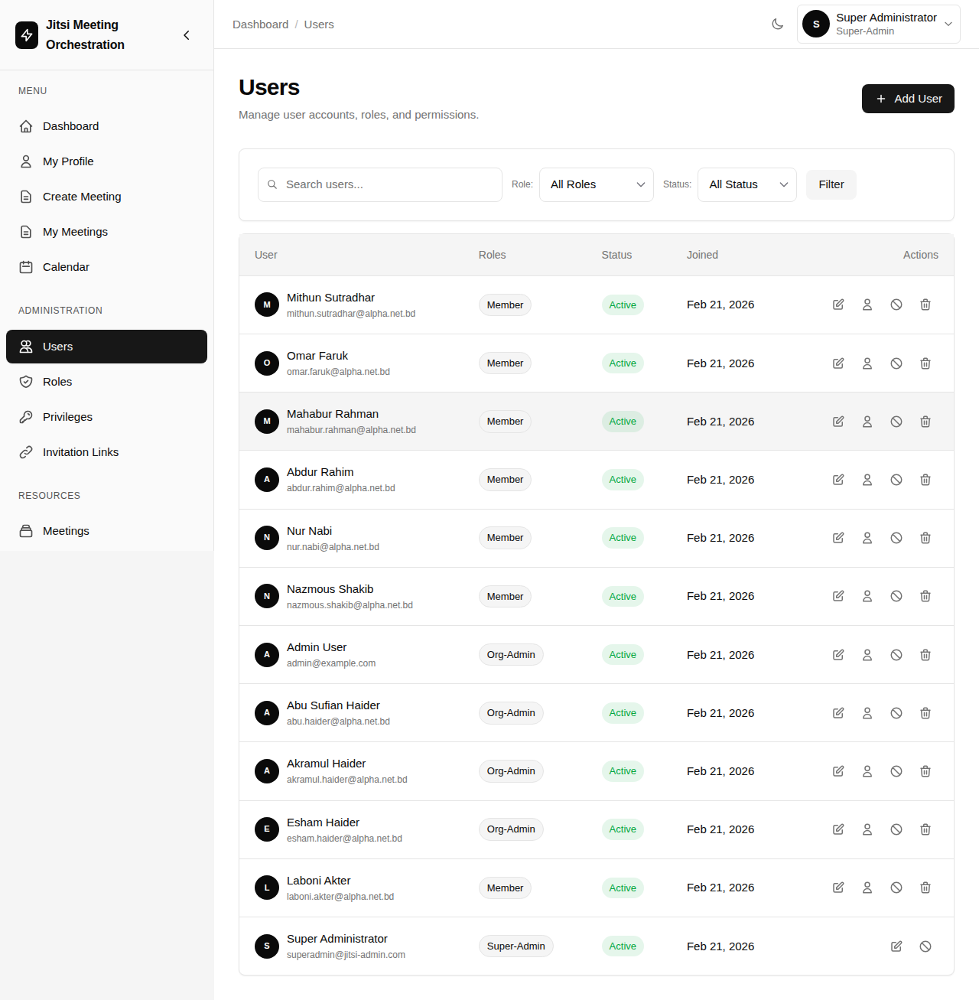
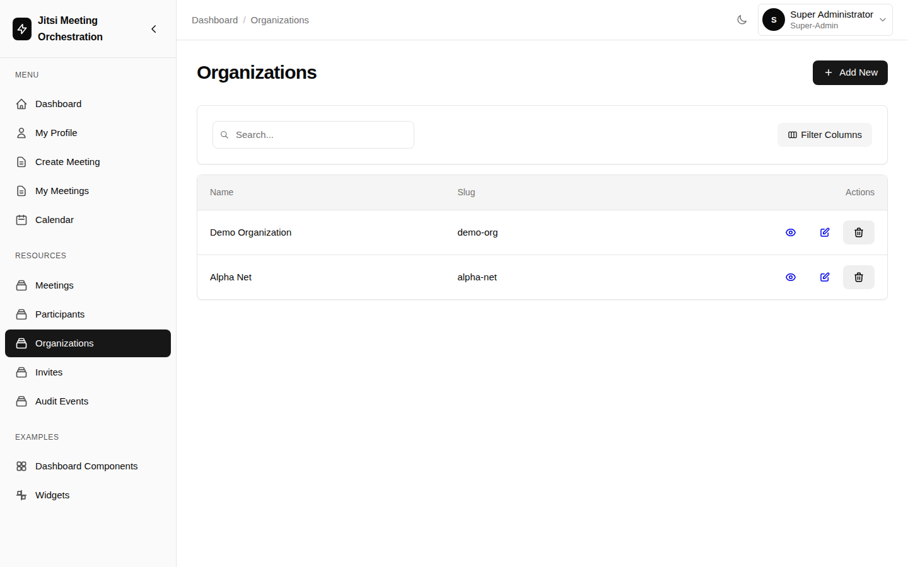
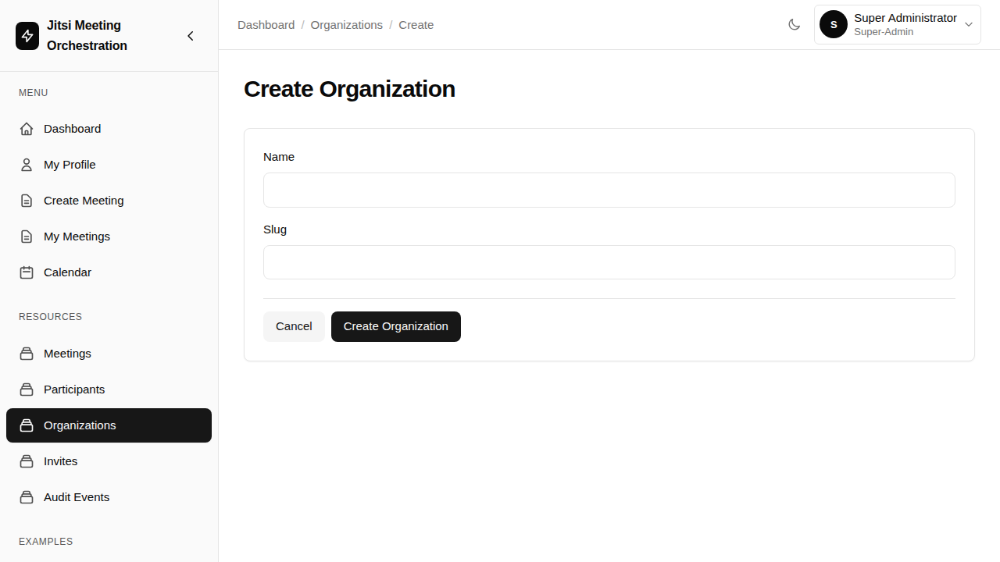
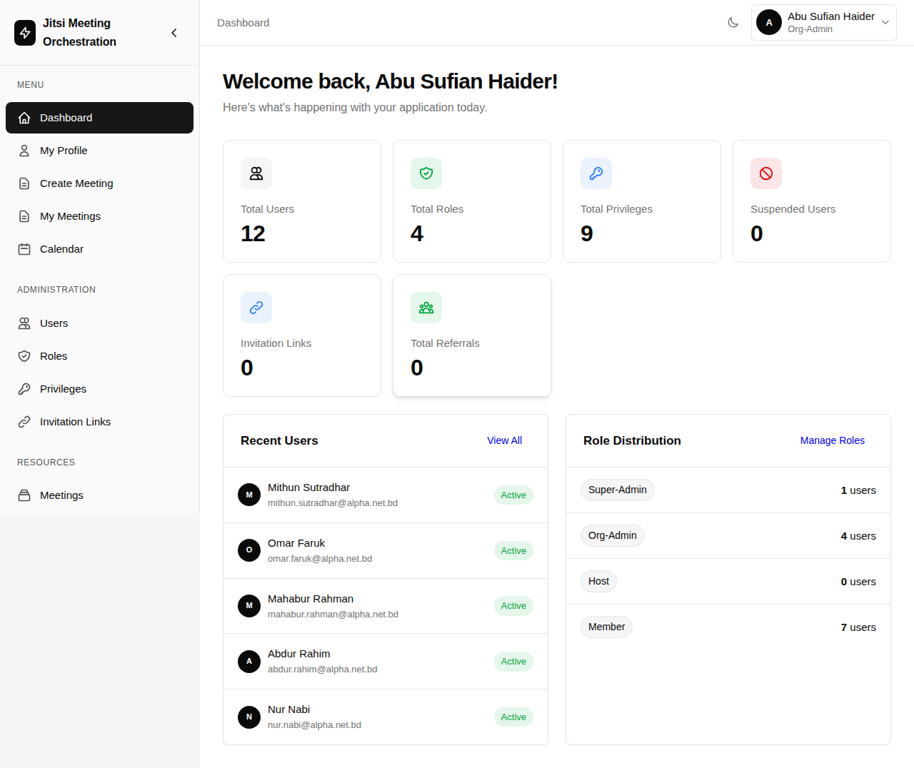
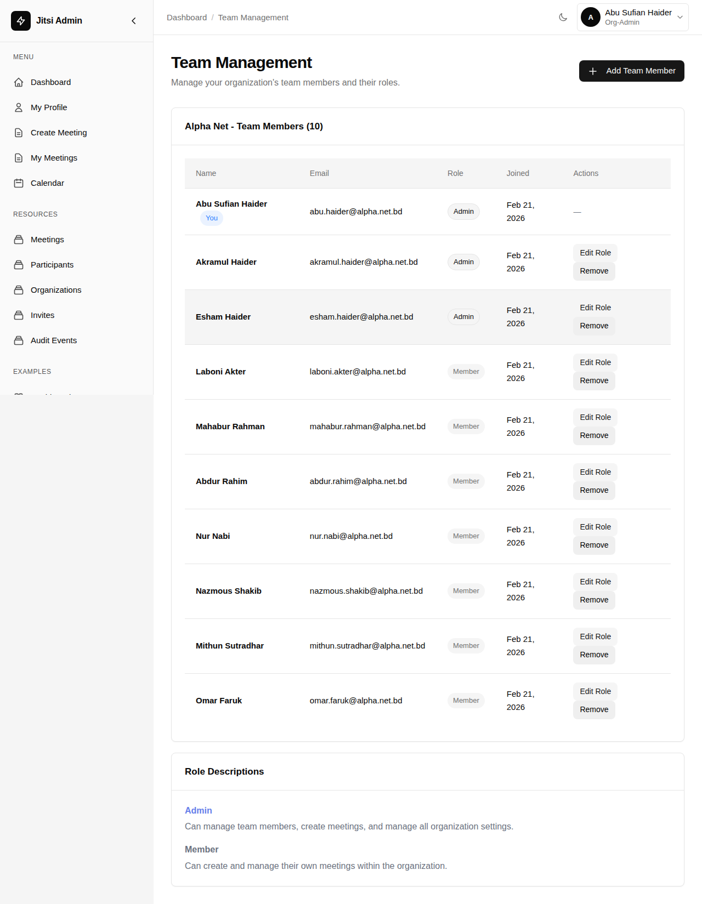
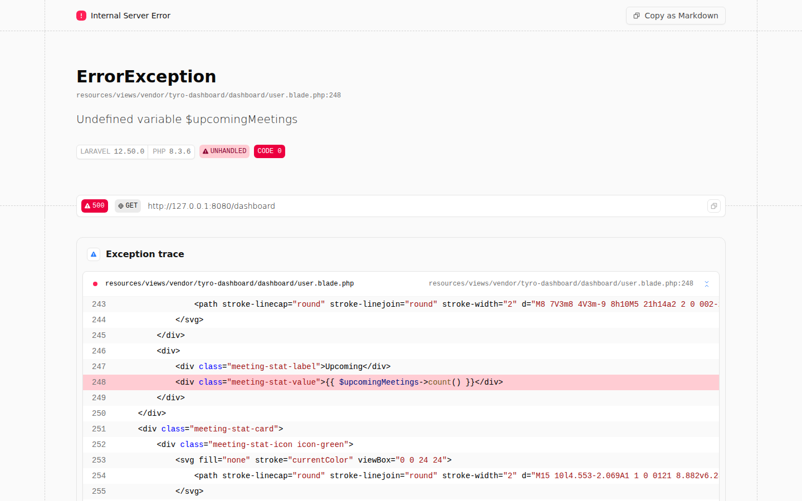
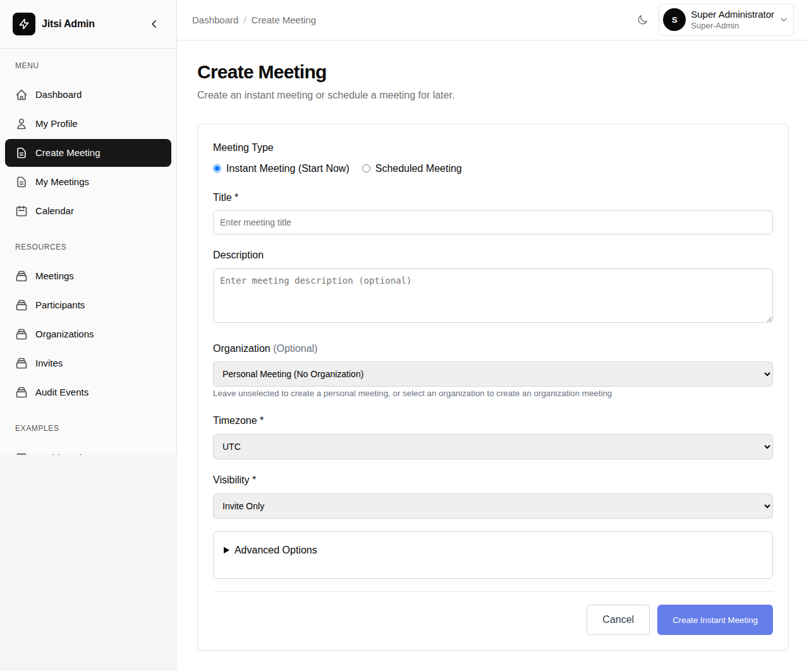
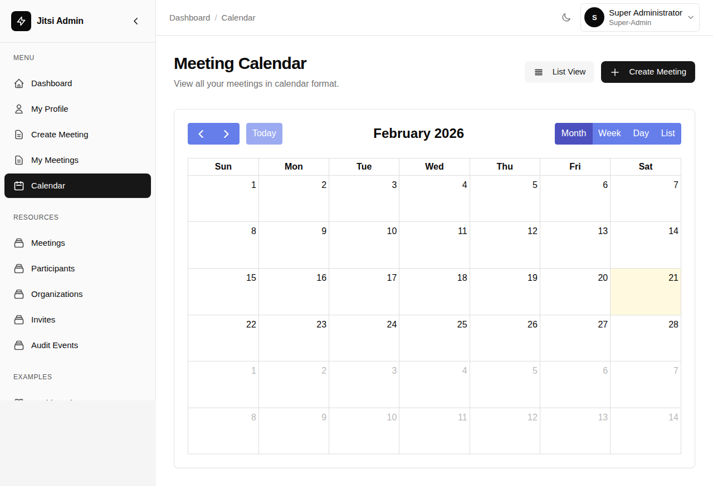

# AloraMeet - Professional Meeting Management Platform

[](LICENSE)
[](https://laravel.com)
[](https://php.net)

A production-ready, enterprise-grade meeting management platform built on Laravel 12 and Jitsi Meet. Provides comprehensive scheduling, access control, invitations, and notifications for professional video conferencing.

## 🌟 Features

### Core Functionality
- **Smart Scheduling** - Single and recurring meetings with timezone support
- **Time-Based Access Control** - Configurable join windows and participant validation
- **JWT Authentication** - Secure, token-based access to Jitsi meetings
- **Multi-Tenant Architecture** - Organization-based separation with role management
- **Complete Audit Trail** - Full visibility into meeting lifecycle and participant actions

### Communication
- **Email Invitations** - Automated invitation emails with calendar attachments (.ics)
- **Meeting Reminders** - Configurable reminder notifications before meetings
- **Status Updates** - Automatic notifications for meeting updates and cancellations
- **Guest Access** - Secure invite links for external participants

### Administration
- **Dashboard** - Comprehensive admin interface powered by Tyro Dashboard
- **Super Admin Panel** - Platform-level control for SaaS operations:
  - **User Management** - Create, edit, suspend, and delete users across all organizations
  - **Organization Management** - Full CRUD operations for organizations
  - **Role & Privilege Management** - Configure roles and permissions system-wide
  - **User Impersonation** - Login as any user for support and troubleshooting
  - **System Analytics** - Platform-wide statistics and insights
- **User Management** - Role-based access control (super-admin, org-admin, host, member)
- **Meeting Management** - Full CRUD operations with participant tracking
- **Audit Logs** - Detailed event logs for compliance and monitoring

## 📸 Preview

### Landing Page
Professional landing page with clear feature presentation and call-to-action buttons.


### Login Interface
Clean and simple login interface with dark mode toggle.


### Dashboard
Comprehensive admin dashboard with statistics, recent users, and role distribution.


### My Meetings
View all your upcoming and past meetings with real-time status indicators.


### Meeting Page
Public meeting page with live status and join button.


## 📋 Requirements

- PHP 8.3 or higher
- Composer
- Node.js & NPM (for asset compilation)
- SQLite/PostgreSQL/MySQL database
- A Jitsi Meet instance (self-hosted or Jitsi.org)

## 🚀 Quick Start

### Installation

1. **Clone the repository**
```bash
git clone https://github.com/md-riaz/Jitsi-Laravel-Admin.git
cd Jitsi-Laravel-Admin
```

2. **Install dependencies**
```bash
composer install
npm install
```

3. **Configure environment**
```bash
cp .env.example .env
php artisan key:generate
```

4. **Set up database**
```bash
touch database/database.sqlite
php artisan migrate --seed
php artisan storage:link
```

If you deploy manually without Docker, `php artisan storage:link` is required so uploaded files on the `public` disk are reachable through `/storage/...` URLs. The included Docker entrypoint already runs this automatically.

**Demo credentials:**

| Account Type | Email | Password | Access Level |
|-------------|-------|----------|--------------|
| **Super Admin** | superadmin@jitsi-admin.com | password | Full platform control - manage all users, organizations, and system settings |
| Demo Org Admin | admin@example.com | password | Manage Demo Organization |

**Alpha Net Organization (https://www.alpha.net.bd/):**

All Alpha Net team members have password: `password`

| Name | Email | Role | Designation |
|------|-------|------|-------------|
| Abu Sufian Haider | abu.haider@alpha.net.bd | Admin | Founder & Director |
| Akramul Haider | akramul.haider@alpha.net.bd | Admin | Chief Executive Officer (CEO) |
| Esham Haider | esham.haider@alpha.net.bd | Admin | Chief Technical Officer (CTO) |
| Laboni Akter | laboni.akter@alpha.net.bd | Member | Chief Human Resources Officer (CHRO) |
| Mahabur Rahman | mahabur.rahman@alpha.net.bd | Member | Dept. Head of Support |
| Abdur Rahim | abdur.rahim@alpha.net.bd | Member | Dept. Head of Sales & Marketing |
| Nur Nabi | nur.nabi@alpha.net.bd | Member | Dept. Head of Digital Marketing |
| Nazmous Shakib | nazmous.shakib@alpha.net.bd | Member | Dept. Head of Training & Communication |
| Mithun Sutradhar | mithun.sutradhar@alpha.net.bd | Member | Dept. Head of Web & Software Development |
| Omar Faruk | omar.faruk@alpha.net.bd | Member | Dept. Head of Accounts & Finance |

5. **Configure Jitsi Integration** (see detailed guide below)

6. **Build and run**
```bash
npm run build
php artisan serve
```

Visit: http://localhost:8000

---

## 🔗 Jitsi Integration Setup (Beginner's Guide)

This platform integrates with Jitsi Meet to provide secure video conferencing. You can use either a self-hosted Jitsi instance or the public Jitsi.org service.

### Option 1: Using Public Jitsi (Easiest - No JWT Required)

For development or testing, you can use the public Jitsi service without authentication:

```env
JITSI_DOMAIN=meet.jit.si
JITSI_JWT_SECRET=
JITSI_JWT_ISSUER=
JITSI_JWT_AUDIENCE=
JITSI_JWT_SUB=
```

**Note:** Without JWT tokens, meetings are not secured. Anyone with the meeting room name can join.

### Option 2: Self-Hosted Jitsi with JWT Authentication (Recommended for Production)

For production use, set up your own Jitsi Meet instance with JWT authentication enabled.

#### Step 1: Install Jitsi Meet

Follow the official Jitsi Meet installation guide: https://jitsi.github.io/handbook/docs/devops-guide/devops-guide-quickstart

#### Step 2: Enable JWT Authentication on Jitsi

1. **Install JWT module:**
```bash
apt-get install libapache2-mod-auth-openidc liblua5.2-dev
cd /usr/share/jitsi-meet/prosody-plugins/
wget https://raw.githubusercontent.com/jitsi-contrib/prosody-plugins/main/token_verification/token_verification.lib.lua
```

2. **Generate a secret key:**
```bash
openssl rand -hex 32
```
Save this output - you'll need it for both Jitsi and Laravel.

3. **Configure Prosody** (`/etc/prosody/conf.avail/your-domain.cfg.lua`):
```lua
VirtualHost "your-domain.com"
    authentication = "token"
    app_id = "your-app"                    -- This is your JWT issuer
    app_secret = "YOUR_SECRET_FROM_STEP_2" -- Secret from step 2
    allow_empty_token = false
```

4. **Update Jitsi Meet config** (`/etc/jitsi/meet/your-domain-config.js`):
```javascript
// Add inside the config object:
enableUserRolesBasedOnToken: true,
```

5. **Restart Jitsi services:**
```bash
systemctl restart prosody
systemctl restart jicofo
systemctl restart jitsi-videobridge2
```

#### Step 3: Configure Laravel Environment

Update your `.env` file with your Jitsi instance details:

```env
# Your Jitsi domain (without https://)
JITSI_DOMAIN=meet.yourdomain.com

# The secret key from Step 2 above
JITSI_JWT_SECRET=YOUR_SECRET_FROM_STEP_2

# Must match app_id in Prosody config (default: your-app)
JITSI_JWT_ISSUER=your-app

# Usually "jitsi" (default audience)
JITSI_JWT_AUDIENCE=jitsi

# Usually same as JITSI_DOMAIN or "*"
JITSI_JWT_SUB=meet.yourdomain.com

# Shared secret for Prosody room lifecycle webhooks
JITSI_WEBHOOK_SECRET=change-this-secret

# Grace period before empty instant meetings are auto-ended
JITSI_EMPTY_ROOM_GRACE_SECONDS=60

# Optional landing page brand colors
LANDING_PRIMARY_COLOR=#2563eb
LANDING_PRIMARY_HOVER_COLOR=#1d4ed8
```

#### Environment Variables Explained

| Variable | Description | Example |
|----------|-------------|---------|
| `JITSI_DOMAIN` | Your Jitsi Meet server domain (no protocol) | `meet.example.com` |
| `JITSI_JWT_SECRET` | Shared secret key for JWT signing (must match Jitsi) | `abc123def456...` |
| `JITSI_JWT_ISSUER` | Application identifier (must match Jitsi `app_id`) | `your-app` |
| `JITSI_JWT_AUDIENCE` | JWT audience claim (usually "jitsi") | `jitsi` |
| `JITSI_JWT_SUB` | JWT subject (usually same as domain or "*") | `meet.example.com` |

### Testing Your Integration

1. **Create a test meeting** in the dashboard
2. **Click "Join Meeting"** - you should be redirected to your Jitsi instance
3. **Verify the URL** includes a JWT token parameter: `?jwt=eyJ...`
4. **Check meeting access** - only invited users should be able to join

### Troubleshooting

**Problem:** "Failed to create a room" error
- Verify `JITSI_DOMAIN` doesn't include `https://` or trailing slashes
- Check that your Jitsi instance is accessible from your server

**Problem:** "Authentication failed" or stuck at lobby
- Verify `JITSI_JWT_SECRET` matches exactly between Laravel and Jitsi config
- Check that `JITSI_JWT_ISSUER` matches the `app_id` in Prosody config
- Ensure JWT authentication is properly enabled in Prosody

**Problem:** Anyone can join meetings
- JWT authentication may not be enabled on Jitsi
- Check Prosody logs: `journalctl -u prosody -f`
- Verify `authentication = "token"` in Prosody config

**Problem:** JWT token expires too quickly
- Token expiration is set to 2 hours by default in `JitsiJwtService.php`
- Adjust the expiration time if needed: `$exp = $now + (2 * 60 * 60);`

## 📖 Key Concepts

### Meeting Workflow
1. Create meeting with participants
2. System sends email invitations with .ics files
3. Guests accept via secure link
4. Join during allowed time window
5. Backend issues JWT for Jitsi access
6. All actions logged for audit

### Email Notifications
- **Invitation** - Sent when invited (includes calendar file)
- **Reminder** - 10 minutes before start
- **Updated** - When meeting details change
- **Cancelled** - When meeting is cancelled

### Access Control
- Join windows prevent early/late access
- JWT tokens validate participants
- Role-based permissions (Tyro RBAC)
- Meeting visibility controls

## 🎯 Product Tour

Explore the platform's features through different user roles without installing anything. See how the interface adapts based on permissions and access levels.

### 1. Landing Page & Authentication

**Professional Landing Page**

The platform features a modern, professional landing page with clear feature presentation and easy navigation.



**Secure Login Interface**

Clean authentication interface with dark mode support and password recovery options.



---

### 2. Super Administrator View

The Super Admin role provides complete platform control for SaaS operations, system-wide user management, and organization oversight.

**Super Admin Dashboard**

Comprehensive platform-level statistics including total users, roles, privileges, organizations, and system health metrics. The dashboard provides quick access to all administrative functions.


**User Management**

Full CRUD operations for all users across all organizations. Super Admins can create, edit, suspend, delete users, and even impersonate them for support purposes. Notice the "Login As" feature for troubleshooting.



**Organization Management**

Manage all organizations in the system with complete visibility and control. Create, view, edit, and delete organizations with their associated settings.



**Organization Creation Workflow**

Simple and intuitive forms for creating new organizations with slug auto-generation and validation.



---

### 3. Organization Admin View

Organization Admins can manage their team members, create organization-wide meetings, and control team access within their organization boundaries.

**Organization Admin Dashboard**

Statistics focused on organization-level metrics including users, roles, and team distribution. Notice the "Administration" section in the sidebar with Users, Roles, and Privileges management.



**Team Management**

Manage team members within your organization. Add members, assign roles (Admin/Member), and control access. The interface clearly shows role differentiation and action permissions.



---

### 4. Member View

Members have access to core meeting functionality without administrative capabilities - focused on creating and joining meetings.

**Member Dashboard**

Simplified dashboard with personal account information and quick access to meeting features. Notice the absence of Administration and Resources sections - members see only what they need.



---

### 5. Meeting Management (All Roles)

**Create Meeting Interface**

Comprehensive meeting creation form with:
- **Meeting Type**: Instant or Scheduled meetings
- **Organization Selection**: Create personal or organization meetings
- **Timezone Support**: Full timezone selection for global teams
- **Visibility Controls**: Invite Only, Anyone with Link, or Organization Only
- **Advanced Options**: Moderator settings, waiting room, recording options



**Calendar View**

Integrated calendar view for visualizing all your meetings at a glance. Switch between calendar and list views for different perspectives. Built with FullCalendar and bundled with the application for reliable offline-first functionality.



---

### Role Comparison

| Feature | Member | Org Admin | Super Admin |
|---------|--------|-----------|-------------|
| Create Meetings | ✅ Personal only | ✅ Personal + Org | ✅ All |
| View Own Meetings | ✅ | ✅ | ✅ |
| Manage Team Members | ❌ | ✅ Own org | ✅ All orgs |
| User Management | ❌ | ✅ Own org | ✅ Platform-wide |
| Organization Management | ❌ | ❌ | ✅ |
| Role & Privilege Config | ❌ | ✅ Own org | ✅ System-wide |
| User Impersonation | ❌ | ❌ | ✅ |
| Meeting Resources | ❌ | ✅ Own org | ✅ All orgs |
| Audit Events | ❌ | ✅ Own org | ✅ Platform-wide |

---

### Try It Yourself

Want to explore these features hands-on? Follow the [Quick Start](#-quick-start) guide to set up the platform locally with demo data. You'll get access to all three user types with pre-seeded accounts.

## 🛠️ Production Deployment

There are two supported deployment paths:

- Docker on a VPS or Docker-capable host
- Manual Ubuntu deployment with Nginx + PHP-FPM + Supervisor

Important constraints:
- this repository deploys only the Laravel admin/orchestration application
- Jitsi Meet is an external system and is not installed by this repo
- you must point `JITSI_DOMAIN` at an existing Jitsi deployment

### Docker deployment on a fresh Ubuntu VPS

Use Docker if you want the simplest production path with the least host-level PHP setup.

What the included stack does:
- `app` runs Nginx + PHP-FPM inside one container on port `8090`
- `queue` runs `php artisan queue:work`
- `scheduler` runs Laravel scheduled tasks every minute
- SQLite is the default database and is persisted in a Docker volume

#### 1. Prepare the VPS

Install Docker Engine and the Compose plugin on Ubuntu, then clone the repo.

```bash
git clone https://github.com/md-riaz/Jitsi-Laravel-Admin.git
cd Jitsi-Laravel-Admin
```

#### 2. Create a production env file

For real deployments, start from `.env.example`, not `stack.env`.

- `.env.example` is the safe template
- `stack.env` is for local/demo-style Docker bootstrapping and should not be treated as production source of truth

```bash
cp .env.example .env
```

Set at least these values:

```env
APP_NAME="AloraMeet"
APP_ENV=production
APP_KEY=base64:GENERATE_A_FRESH_KEY
APP_DEBUG=false
APP_URL=https://your-domain.com

DB_CONNECTION=sqlite
DB_DATABASE=/var/www/html/database/database.sqlite

QUEUE_CONNECTION=database
CACHE_STORE=database
SESSION_DRIVER=database

MAIL_MAILER=smtp
MAIL_HOST=[mail_host]
MAIL_PORT=[mail_port]
MAIL_USERNAME=[mail_username]
MAIL_PASSWORD=[mail_password]
MAIL_FROM_ADDRESS=[email]
MAIL_FROM_NAME="AloraMeet"

JITSI_DOMAIN=meet.your-domain.com
JITSI_JWT_SECRET=[secret]
JITSI_JWT_ISSUER=[issuer]
JITSI_JWT_AUDIENCE=jitsi
JITSI_JWT_SUB=meet.your-domain.com
JITSI_WEBHOOK_SECRET=[webhook_secret]

RUN_MIGRATIONS=true
RUN_SEEDERS=false
```

Generate the app key with:

```bash
php artisan key:generate --show
```

Paste that value into `.env` as `APP_KEY`.

#### 3. Start the stack

```bash
docker compose up --build -d
```

By default the app is exposed on host port `18090`.

#### 4. Put a reverse proxy in front of it

For a real VPS deployment, terminate TLS in host Nginx, Caddy, Traefik, or your cloud load balancer and proxy to `127.0.0.1:18090`.

Typical production flow:
- public traffic on `443`
- reverse proxy forwards to `127.0.0.1:18090`
- `APP_URL` is set to your public HTTPS URL

#### 5. First boot vs normal restarts

On first boot:
- keep `RUN_MIGRATIONS=true`
- keep `RUN_SEEDERS=false` unless you explicitly want demo/sample data

After the schema is created:
- set `RUN_MIGRATIONS=false`
- keep `RUN_SEEDERS=false`

#### 6. Common Docker operations

```bash
# View running services
docker compose ps

# Follow app logs
docker compose logs -f app

# Follow queue logs
docker compose logs -f queue

# Follow scheduler logs
docker compose logs -f scheduler

# Run artisan inside the app container
docker compose exec app php artisan about

# Stop the stack
docker compose down
```

#### 7. Persistent data

Docker named volumes are used for:
- `storage`
- `database`

If you want a full local reset:

```bash
docker compose down -v
```

Do not run that on a real VPS unless you intentionally want to wipe persisted SQLite and app storage.

### Manual Ubuntu deployment

If you prefer a traditional VPS setup, deploy with Nginx, PHP-FPM, Supervisor, and Cron.

Use the full guide in [DEPLOYMENT.md](DEPLOYMENT.md).

Minimum flow:

```bash
composer install --optimize-autoloader --no-dev
npm install
npm run build
php artisan migrate --force
php artisan config:cache
php artisan route:cache
php artisan view:cache
```

You must also run:
- a queue worker via Supervisor
- `php artisan schedule:run` every minute via cron
- Nginx in front of PHP-FPM

### Platform-as-a-Service

Most platforms that support Docker can deploy from this repository directly.

Minimum env vars:
- `APP_KEY`
- `APP_ENV=production`
- `APP_DEBUG=false`
- `APP_URL`
- database settings
- mail settings
- Jitsi settings
- `RUN_MIGRATIONS=true` only for first deployment
- `RUN_SEEDERS=false`

## 📚 Documentation

- **[Deployment Guide](DEPLOYMENT.md)** - Canonical production deployment guide for Docker and manual Ubuntu installs
- **[Setup Guide](SETUP.md)** - Local setup and installation notes
- **[Project Spec](PROJECT_SPEC.md)** - Complete feature specifications
- **[Architecture](ARCHITECTURE.md)** - System design and patterns
- **[Domain Rules](DOMAIN_RULES.md)** - Business logic and constraints
- **[Backend API Reference](docs/API_REFERENCE.md)** - Current API contract and join flow error codes
- **[API v1 Spec](docs/API_V1_SPEC.md)** - Client-ready endpoint contract (web/flutter/desktop)
- **[Postman Collection (API v1)](docs/API_V1.postman_collection.json)** - Quick smoke test suite
- **[Updated Screenshots Map](docs/UPDATED_SCREENSHOTS.md)** - Existing screenshots + capture list for new pages

## 🔧 Development

```bash
# Run tests
php artisan test

# Watch assets
npm run dev -- --watch

# Check logs
tail -f storage/logs/laravel.log

# View failed queue jobs
php artisan queue:failed
```

## 🤝 Contributing

Contributions welcome! Please:
1. Fork the repository
2. Create feature branch
3. Commit changes
4. Push and open Pull Request

## 📄 License

MIT License - see [LICENSE](LICENSE) file

## 🙏 Credits

Built with [Laravel](https://laravel.com), [Jitsi Meet](https://jitsi.org), and [Tyro](https://github.com/hasinhayder/tyro)

---

**Professional Meeting Management Made Simple**
