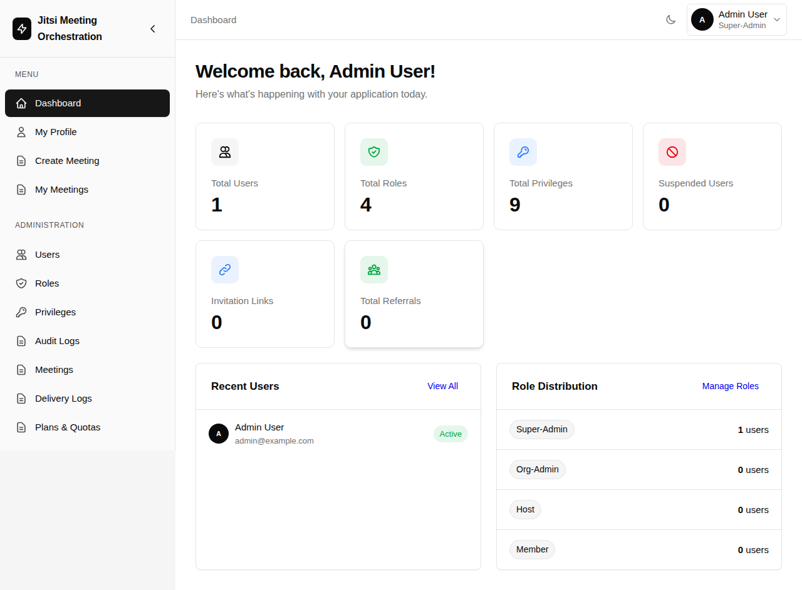
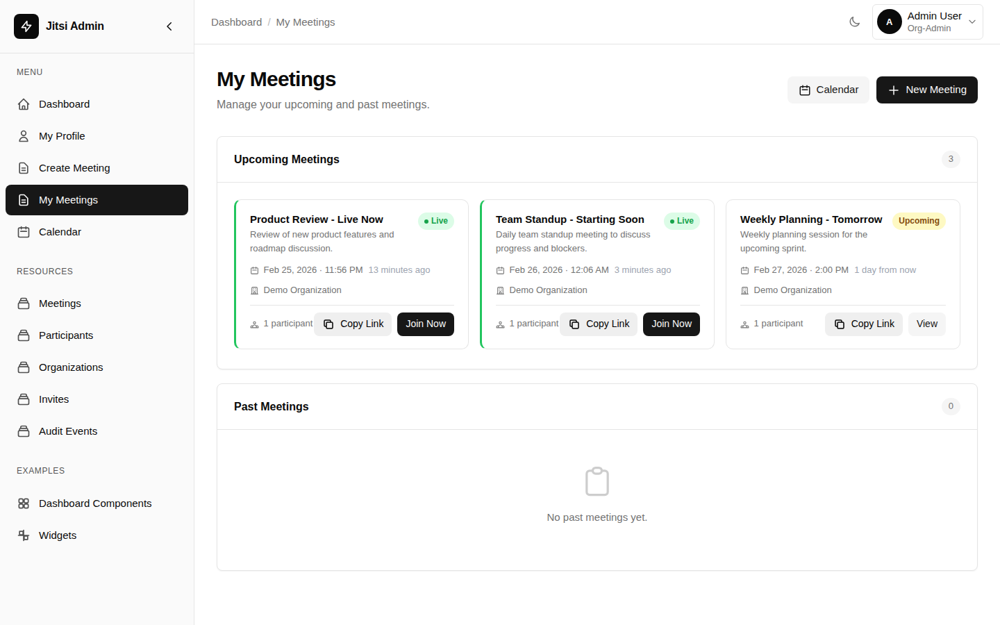
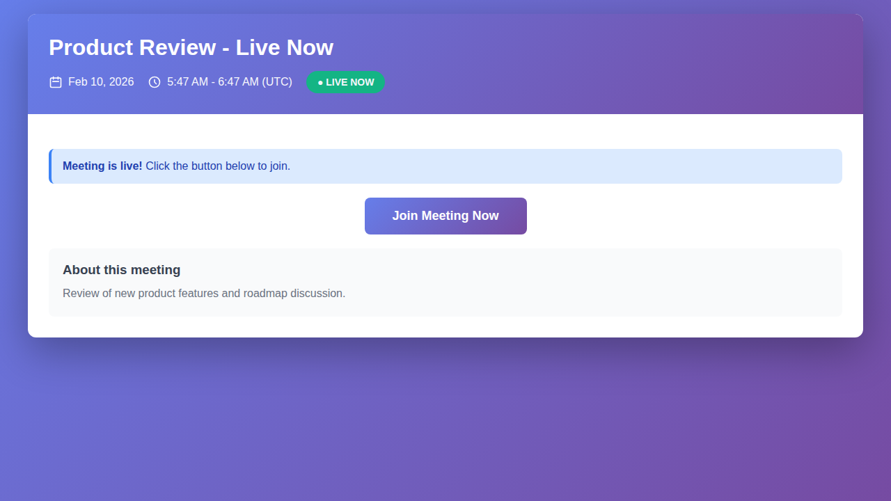

# Jitsi Admin - Professional Meeting Management Platform

[](LICENSE)
[](https://laravel.com)
[](https://php.net)

A production-ready, enterprise-grade meeting management platform built on Laravel 12 and Jitsi Meet. Provides comprehensive scheduling, access control, invitations, and notifications for professional video conferencing.

## 🌟 Features

### Core Functionality
- **Smart Scheduling** - Single and recurring meetings with timezone support
- **Time-Based Access Control** - Configurable join windows and participant validation
- **JWT Authentication** - Secure, token-based access to Jitsi meetings
- **Multi-Tenant Architecture** - Organization-based separation with role management
- **Complete Audit Trail** - Full visibility into meeting lifecycle and participant actions

### Communication
- **Email Invitations** - Automated invitation emails with calendar attachments (.ics)
- **Meeting Reminders** - Configurable reminder notifications before meetings
- **Status Updates** - Automatic notifications for meeting updates and cancellations
- **Guest Access** - Secure invite links for external participants

### Administration
- **Dashboard** - Comprehensive admin interface powered by Tyro Dashboard
- **User Management** - Role-based access control (super-admin, org-admin, host, member)
- **Meeting Management** - Full CRUD operations with participant tracking
- **Audit Logs** - Detailed event logs for compliance and monitoring

## 📸 Preview

### Landing Page
Professional landing page with clear feature presentation and call-to-action buttons.


### Login Interface
Clean and simple login interface with dark mode toggle.


### Dashboard
Comprehensive admin dashboard with statistics, recent users, and role distribution.



### My Meetings
View all your upcoming and past meetings with real-time status indicators.



### Meeting Page
Public meeting page with live status and join button.



## 📋 Requirements

- PHP 8.3 or higher
- Composer
- Node.js & NPM (for asset compilation)
- SQLite/PostgreSQL/MySQL database
- A Jitsi Meet instance (self-hosted or Jitsi.org)

## 🚀 Quick Start

### Installation

1. **Clone the repository**
```bash
git clone https://github.com/md-riaz/Jitsi-Laravel-Admin.git
cd Jitsi-Laravel-Admin
```

2. **Install dependencies**
```bash
composer install
npm install
```

3. **Configure environment**
```bash
cp .env.example .env
php artisan key:generate
```

4. **Set up database**
```bash
touch database/database.sqlite
php artisan migrate --seed
```

Demo credentials: `admin@example.com` / `password`

5. **Configure Jitsi Integration** (see detailed guide below)

6. **Build and run**
```bash
npm run build
php artisan serve
```

Visit: http://localhost:8000

---

## 🔗 Jitsi Integration Setup (Beginner's Guide)

This platform integrates with Jitsi Meet to provide secure video conferencing. You can use either a self-hosted Jitsi instance or the public Jitsi.org service.

### Option 1: Using Public Jitsi (Easiest - No JWT Required)

For development or testing, you can use the public Jitsi service without authentication:

```env
JITSI_DOMAIN=meet.jit.si
JITSI_JWT_SECRET=
JITSI_JWT_ISSUER=
JITSI_JWT_AUDIENCE=
JITSI_JWT_SUB=
```

**Note:** Without JWT tokens, meetings are not secured. Anyone with the meeting room name can join.

### Option 2: Self-Hosted Jitsi with JWT Authentication (Recommended for Production)

For production use, set up your own Jitsi Meet instance with JWT authentication enabled.

#### Step 1: Install Jitsi Meet

Follow the official Jitsi Meet installation guide: https://jitsi.github.io/handbook/docs/devops-guide/devops-guide-quickstart

#### Step 2: Enable JWT Authentication on Jitsi

1. **Install JWT module:**
```bash
apt-get install libapache2-mod-auth-openidc liblua5.2-dev
cd /usr/share/jitsi-meet/prosody-plugins/
wget https://raw.githubusercontent.com/jitsi-contrib/prosody-plugins/main/token_verification/token_verification.lib.lua
```

2. **Generate a secret key:**
```bash
openssl rand -hex 32
```
Save this output - you'll need it for both Jitsi and Laravel.

3. **Configure Prosody** (`/etc/prosody/conf.avail/your-domain.cfg.lua`):
```lua
VirtualHost "your-domain.com"
    authentication = "token"
    app_id = "your-app"                    -- This is your JWT issuer
    app_secret = "YOUR_SECRET_FROM_STEP_2" -- Secret from step 2
    allow_empty_token = false
```

4. **Update Jitsi Meet config** (`/etc/jitsi/meet/your-domain-config.js`):
```javascript
// Add inside the config object:
enableUserRolesBasedOnToken: true,
```

5. **Restart Jitsi services:**
```bash
systemctl restart prosody
systemctl restart jicofo
systemctl restart jitsi-videobridge2
```

#### Step 3: Configure Laravel Environment

Update your `.env` file with your Jitsi instance details:

```env
# Your Jitsi domain (without https://)
JITSI_DOMAIN=meet.yourdomain.com

# The secret key from Step 2 above
JITSI_JWT_SECRET=YOUR_SECRET_FROM_STEP_2

# Must match app_id in Prosody config (default: your-app)
JITSI_JWT_ISSUER=your-app

# Usually "jitsi" (default audience)
JITSI_JWT_AUDIENCE=jitsi

# Usually same as JITSI_DOMAIN or "*"
JITSI_JWT_SUB=meet.yourdomain.com
```

#### Environment Variables Explained

| Variable | Description | Example |
|----------|-------------|---------|
| `JITSI_DOMAIN` | Your Jitsi Meet server domain (no protocol) | `meet.example.com` |
| `JITSI_JWT_SECRET` | Shared secret key for JWT signing (must match Jitsi) | `abc123def456...` |
| `JITSI_JWT_ISSUER` | Application identifier (must match Jitsi `app_id`) | `your-app` |
| `JITSI_JWT_AUDIENCE` | JWT audience claim (usually "jitsi") | `jitsi` |
| `JITSI_JWT_SUB` | JWT subject (usually same as domain or "*") | `meet.example.com` |

### Testing Your Integration

1. **Create a test meeting** in the dashboard
2. **Click "Join Meeting"** - you should be redirected to your Jitsi instance
3. **Verify the URL** includes a JWT token parameter: `?jwt=eyJ...`
4. **Check meeting access** - only invited users should be able to join

### Troubleshooting

**Problem:** "Failed to create a room" error
- Verify `JITSI_DOMAIN` doesn't include `https://` or trailing slashes
- Check that your Jitsi instance is accessible from your server

**Problem:** "Authentication failed" or stuck at lobby
- Verify `JITSI_JWT_SECRET` matches exactly between Laravel and Jitsi config
- Check that `JITSI_JWT_ISSUER` matches the `app_id` in Prosody config
- Ensure JWT authentication is properly enabled in Prosody

**Problem:** Anyone can join meetings
- JWT authentication may not be enabled on Jitsi
- Check Prosody logs: `journalctl -u prosody -f`
- Verify `authentication = "token"` in Prosody config

**Problem:** JWT token expires too quickly
- Token expiration is set to 2 hours by default in `JitsiJwtService.php`
- Adjust the expiration time if needed: `$exp = $now + (2 * 60 * 60);`

## 📖 Key Concepts

### Meeting Workflow
1. Create meeting with participants
2. System sends email invitations with .ics files
3. Guests accept via secure link
4. Join during allowed time window
5. Backend issues JWT for Jitsi access
6. All actions logged for audit

### Email Notifications
- **Invitation** - Sent when invited (includes calendar file)
- **Reminder** - 10 minutes before start
- **Updated** - When meeting details change
- **Cancelled** - When meeting is cancelled

### Access Control
- Join windows prevent early/late access
- JWT tokens validate participants
- Role-based permissions (Tyro RBAC)
- Meeting visibility controls

## 🛠️ Production Deployment

### Quick Start with Docker

The easiest way to deploy this application in production is using Docker. The included `Dockerfile` builds a production-ready image.

#### 1. Local Docker Testing

Test the Docker setup locally:

```bash
docker compose up --build
```

Access the application at: http://localhost:8090

#### 2. Production Docker Deployment

For production, you have several options:

**Option A: Docker Compose (Recommended for single-server deployments)**

Create a `docker-compose.production.yml`:

```yaml
services:
  app:
    build:
      context: .
      dockerfile: Dockerfile
    ports:
      - "8090:8090"
    environment:
      # App Configuration
      APP_NAME: "Jitsi Admin"
      APP_ENV: production
      APP_DEBUG: "false"
      APP_KEY: "base64:YOUR_APP_KEY_HERE"  # Generate with: php artisan key:generate --show
      APP_URL: https://your-domain.com
      
      # Database Configuration (SQLite - single file database)
      DB_CONNECTION: sqlite
      DB_DATABASE: /var/www/html/database/database.sqlite
      
      # Run migrations on container start (set to "false" after first run)
      RUN_MIGRATIONS: "true"
      
      # Mail Configuration (required for invitations)
      MAIL_MAILER: smtp
      MAIL_HOST: smtp.your-provider.com
      MAIL_PORT: 587
      MAIL_USERNAME: your-email@domain.com
      MAIL_PASSWORD: your-password
      MAIL_ENCRYPTION: tls
      MAIL_FROM_ADDRESS: noreply@your-domain.com
      MAIL_FROM_NAME: "Jitsi Admin"
      
      # Jitsi Integration (see Jitsi Integration Setup section above)
      JITSI_DOMAIN: meet.your-domain.com
      JITSI_JWT_SECRET: your-shared-secret-key
      JITSI_JWT_ISSUER: your-app
      JITSI_JWT_AUDIENCE: jitsi
      JITSI_JWT_SUB: meet.your-domain.com
      
      # Queue & Cache (database-based, no Redis needed)
      QUEUE_CONNECTION: database
      CACHE_STORE: database
      SESSION_DRIVER: database
      
      # Server Port
      PORT: 8090
      
    volumes:
      # Persist database and storage across container restarts
      - ./database:/var/www/html/database
      - ./storage:/var/www/html/storage
    
    restart: unless-stopped
    
    # Optional: Run queue worker in same container
    command: >
      sh -c "php artisan serve --host=0.0.0.0 --port=8090 &
             php artisan queue:work database --tries=3 --sleep=3 --max-time=3600"
```

Deploy with:

```bash
docker compose -f docker-compose.production.yml up -d
```

**Option B: Docker with PostgreSQL (For larger deployments)**

```yaml
services:
  app:
    build:
      context: .
      dockerfile: Dockerfile
    ports:
      - "8090:8090"
    environment:
      APP_NAME: "Jitsi Admin"
      APP_ENV: production
      APP_DEBUG: "false"
      APP_KEY: "base64:YOUR_APP_KEY_HERE"
      APP_URL: https://your-domain.com
      
      # PostgreSQL Configuration
      DB_CONNECTION: pgsql
      DB_HOST: db
      DB_PORT: 5432
      DB_DATABASE: jitsi_admin
      DB_USERNAME: jitsi_user
      DB_PASSWORD: secure_password_here
      
      RUN_MIGRATIONS: "true"
      
      # Mail settings...
      MAIL_MAILER: smtp
      MAIL_HOST: smtp.your-provider.com
      MAIL_PORT: 587
      MAIL_USERNAME: your-email@domain.com
      MAIL_PASSWORD: your-password
      MAIL_ENCRYPTION: tls
      MAIL_FROM_ADDRESS: noreply@your-domain.com
      MAIL_FROM_NAME: "Jitsi Admin"
      
      # Jitsi settings...
      JITSI_DOMAIN: meet.your-domain.com
      JITSI_JWT_SECRET: your-shared-secret-key
      JITSI_JWT_ISSUER: your-app
      JITSI_JWT_AUDIENCE: jitsi
      JITSI_JWT_SUB: meet.your-domain.com
      
      QUEUE_CONNECTION: database
      CACHE_STORE: database
      SESSION_DRIVER: database
      PORT: 8090
      
    depends_on:
      - db
    restart: unless-stopped
    
  db:
    image: postgres:16-alpine
    environment:
      POSTGRES_DB: jitsi_admin
      POSTGRES_USER: jitsi_user
      POSTGRES_PASSWORD: secure_password_here
    volumes:
      - postgres_data:/var/lib/postgresql/data
    restart: unless-stopped

volumes:
  postgres_data:
```

**Option C: Platform-as-a-Service (Heroku, Railway, Render, etc.)**

Most platforms can deploy directly from GitHub:

1. Connect your GitHub repository
2. Platform auto-detects the `Dockerfile`
3. Set environment variables in the platform's dashboard:
   - `APP_KEY` (generate with `php artisan key:generate --show`)
   - `APP_ENV=production`
   - `APP_DEBUG=false`
   - `APP_URL` (your app's URL)
   - Database credentials (if using platform's database)
   - Mail settings (SMTP or platform's email service)
   - Jitsi settings
   - `RUN_MIGRATIONS=true` (for first deployment)
4. Deploy!

### Environment Variables for Docker Production

**Essential Variables (Must be set):**

```env
APP_KEY=base64:YOUR_GENERATED_KEY_HERE
APP_ENV=production
APP_DEBUG=false
APP_URL=https://your-domain.com
```

**Database Variables:**

For SQLite (easiest, perfect for small-medium deployments):
```env
DB_CONNECTION=sqlite
DB_DATABASE=/var/www/html/database/database.sqlite
```

For PostgreSQL (recommended for larger deployments):
```env
DB_CONNECTION=pgsql
DB_HOST=your-postgres-host
DB_PORT=5432
DB_DATABASE=your-database-name
DB_USERNAME=your-username
DB_PASSWORD=your-password
```

**Mail Variables (Required for invitations):**

```env
MAIL_MAILER=smtp
MAIL_HOST=smtp.your-provider.com
MAIL_PORT=587
MAIL_USERNAME=your-email@domain.com
MAIL_PASSWORD=your-password
MAIL_ENCRYPTION=tls
MAIL_FROM_ADDRESS=noreply@your-domain.com
MAIL_FROM_NAME="Jitsi Admin"
```

**Jitsi Variables:**

```env
JITSI_DOMAIN=meet.your-domain.com
JITSI_JWT_SECRET=your-shared-secret
JITSI_JWT_ISSUER=your-app
JITSI_JWT_AUDIENCE=jitsi
JITSI_JWT_SUB=meet.your-domain.com
```

**Queue & Session Variables:**

```env
QUEUE_CONNECTION=database
CACHE_STORE=database
SESSION_DRIVER=database
```

**Optional Variables:**

```env
PORT=8090                    # Container port (default: 8090)
RUN_MIGRATIONS=true         # Run migrations on startup (set false after initial run)
LOG_CHANNEL=stack           # Logging configuration
LOG_LEVEL=info              # Log verbosity (debug, info, warning, error)
```

### Docker Health Checks & Best Practices

#### Health Check

Add health check to your docker-compose.yml:

```yaml
services:
  app:
    # ... other config ...
    healthcheck:
      test: ["CMD", "curl", "-f", "http://localhost:8090/"]
      interval: 30s
      timeout: 10s
      retries: 3
      start_period: 40s
```

#### Volume Permissions

If you encounter permission issues:

```bash
# On host machine
chmod -R 777 storage database
```

Or in Dockerfile (already included):
```dockerfile
RUN chown -R www-data:www-data storage bootstrap/cache
```

#### Queue Worker

For production, run a dedicated queue worker:

```bash
# Option 1: Inside the same container
docker exec -d your-container-name php artisan queue:work database --tries=3

# Option 2: Separate service in docker-compose.yml
services:
  queue:
    build:
      context: .
      dockerfile: Dockerfile
    command: php artisan queue:work database --tries=3 --sleep=3
    environment:
      # Same env vars as app service
    depends_on:
      - app
```

#### Logs

View application logs:

```bash
docker logs -f container-name                    # Follow logs
docker exec container-name tail -f storage/logs/laravel.log
```

### Manual Production Deployment (Non-Docker)

If deploying without Docker:

1. **Optimize**
```bash
composer install --optimize-autoloader --no-dev
php artisan config:cache
php artisan route:cache
php artisan view:cache
npm run build
```

2. **Environment**
```env
APP_ENV=production
APP_DEBUG=false
QUEUE_CONNECTION=database
CACHE_STORE=database
SESSION_DRIVER=database
```

3. **Queue Worker** (use Supervisor)
```bash
php artisan queue:work database --tries=3
```

4. **Permissions**
```bash
chown -R www-data:www-data storage bootstrap/cache
chmod -R 775 storage bootstrap/cache
```

See [SETUP.md](SETUP.md) for detailed deployment guide.

## 📚 Documentation

- **[Setup Guide](SETUP.md)** - Detailed installation instructions
- **[Project Spec](PROJECT_SPEC.md)** - Complete feature specifications
- **[Architecture](ARCHITECTURE.md)** - System design and patterns
- **[Domain Rules](DOMAIN_RULES.md)** - Business logic and constraints

## 🔧 Development

```bash
# Run tests
php artisan test

# Watch assets
npm run dev -- --watch

# Check logs
tail -f storage/logs/laravel.log

# View failed queue jobs
php artisan queue:failed
```

## 🤝 Contributing

Contributions welcome! Please:
1. Fork the repository
2. Create feature branch
3. Commit changes
4. Push and open Pull Request

## 📄 License

MIT License - see [LICENSE](LICENSE) file

## 🙏 Credits

Built with [Laravel](https://laravel.com), [Jitsi Meet](https://jitsi.org), and [Tyro](https://github.com/hasinhayder/tyro)

---

**Professional Meeting Management Made Simple**
